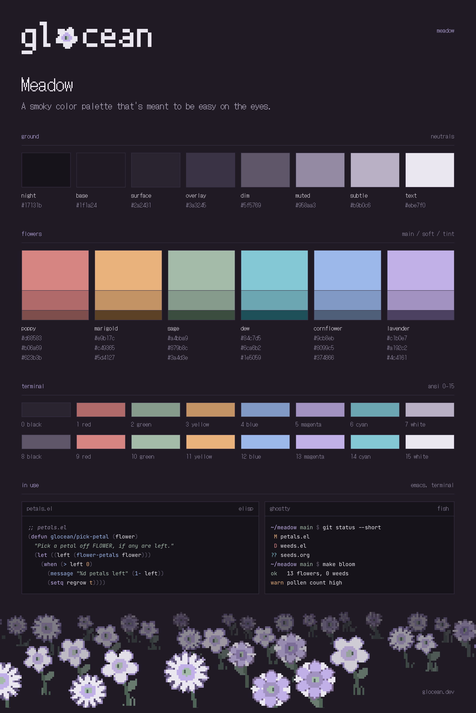
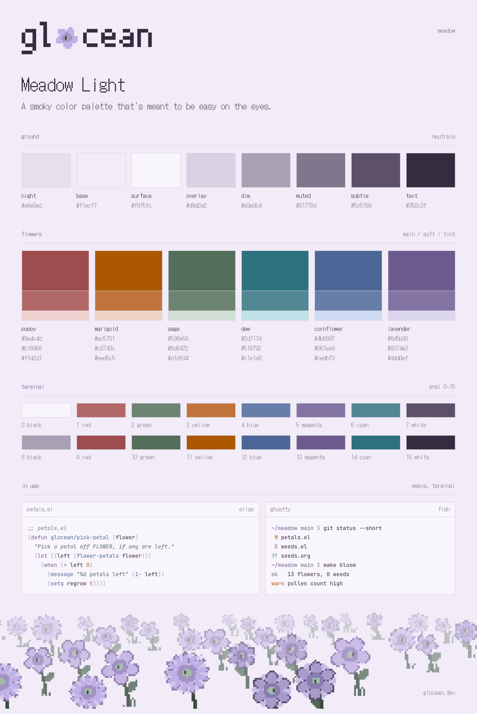

# Meadow

A smoky color palette that's meant to be easy on the eyes. There are two versions, Meadow and Meadow Light.

  
  

## The palette

Eight neutrals for the ground colors, and six flower shades that each come in a main, soft and tint variations. You can see all of them (and copy any of them with a click) at [glocean.dev/meadow](https://glocean.dev/meadow/), or grab them straight from [palette.json](palette.json).

| Flower | Meadow | Meadow Light |
|---|---|---|
| poppy | `#d68583` | `#9e4c4d` |
| marigold | `#e9b17c` | `#ac5701` |
| sage | `#a4bba9` | `#536e59` |
| dew | `#84c7d5` | `#2d717d` |
| cornflower | `#9cb8eb` | `#4b6697` |
| lavender | `#c1b0e7` | `#6d5b90` |

These are just the main shades. The full list, along with which color goes where, is in the guidelines.

## Ports

- [Ghostty](ports/ghostty)

## Guidelines

If you want to make a port, please read [GUIDELINES.md](GUIDELINES.md) first. It is short, I promise. It says which color is used for what (keywords, strings, errors, diffs, and so on), so every port ends up looking like the same theme.

## Requesting a Port

If there isn't a port for an app you use, and you can't make one yourself, feel free to open an issue. Do note that none of the maintainers are obligated to make a requested port.

## Submitting a Port

If you have made a port, then go ahead and open a pull request that adds it to `ports/`. After a review, it will be added here and to the website.

## Contrast

Meadow is low contrast on purpose, and it does not try to meet any accessibility contrast targets, so it might not work for you if you need high contrast. If that is the case, I would honestly recommend [Protesilaos' Modus themes](https://protesilaos.com/emacs/modus-themes), they are about as good as it gets.

## License

[MIT](LICENSE)
